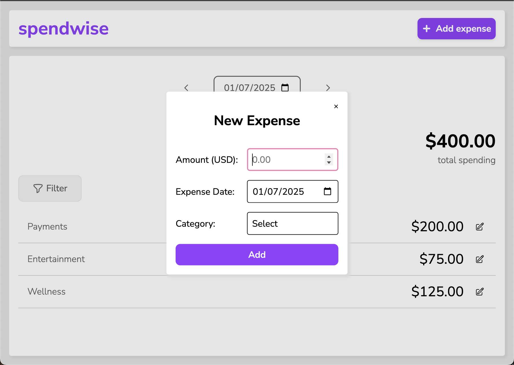
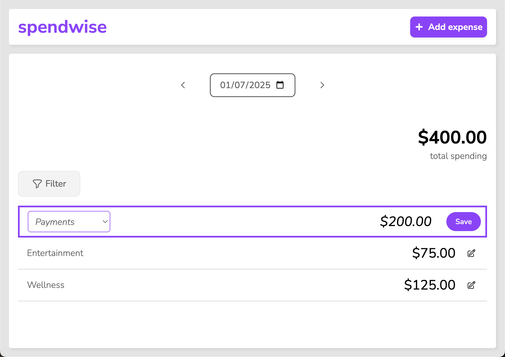

## Projects

### Expense Tracker

A lightweight vanilla JavaScript application for tracking personal expenses.

#### Features

- **Track Expenses:** Easily add, edit, and delete expenses to keep track of spending
- **Category Breakdown:** View expenses by category for better financial organization
- **User-Friendly Interface:** Simple, clean, and intuitive design that adapts seamlessly to all screen sizes
- **Data Persistence:** All data saved locally using the Local Storage API

#### Interface Preview

[▶️ Watch Demo Video](assets/videos/expense-tracker-snippet.mp4)

#### Technologies Used

- HTML5
- CSS3
- Vanilla JavaScript
- Mocha
- Chai
- Local Storage API

#### Links

- [Live Demo](https://mariella-arias.github.io/expense-tracker)
- [View Code](https://github.com/mariella-arias/expense-tracker)

## About

[View Resume](link-to-resume) • [GitHub](https://github.com/mariella-arias)
